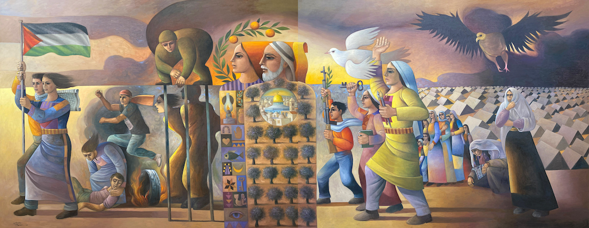

# gaza_citizenjournalism
A repository of citizen journalists on the ground in Gaza posting information direct from the source (as opposed to through the filter of legacy media).

I have been bothered by the biased and unreliable way the legacy media are reporting on the conflict, therefore, I have decided to make this repository to help amass a collection of citizen journalists who are reporting from the ground.

Every measure should be taken to ensure every addition to this list is as unbiased and accurate as possible. The intention of this repo is to mitigate propaganda/psyops and ensure that truthful information is disseminated to the surface which will in turn allow for those alienated from the conflict to discern the most truthful perspective.

This repository is not about politics, but for the documentation of truth and reality.

Please feel free to submit pull requests.

 

---
 

 

Sliman Mansour, Revolution was the Beginning, 2016, oil on canvas.

 

---

 

### Citizen Journalists
Name | Description | Languages | Platform |
|---|---|---|---|
| [Abdalrahim Alfarra](https://x.com/AboodMalfarra) | Citizen in Gaza. | EN | X |
| [Afaf Ahmed](https://www.instagram.com/afafpall_/) | Journalist posting situational updates. | EN | Instagram |
| [Ahmed Aborjelaa](https://www.instagram.com/aborjelaa/) | Video maker capturing testimonials of people. | AR, EN subtitles | Instagram |
| [Ahmed Hijazi](https://www.instagram.com/ahmedhijazee/) | Posting updates. Mostly Al-Shifaa Hospital. | AR, EN subtitles | Instagram |
| [Aya Isleem](https://x.com/AyaIsleemEn) | Palestinian journalist. | EN | X |
| [Belal Khaled](https://www.instagram.com/belalkh/) | Artist posting updates. | AR | Instagram |
| [Bisan](https://www.instagram.com/wizard_bisan1/) | Film/content maker. On the ground updates. | EN | Instagram |
| [Doaa Rouqa](https://www.instagram.com/doaaj94/) | Journalist in Gaza. | AR | Instagram |
| [Fares Anbar](https://www.instagram.com/faressol2/) | Artist posting updates in Gaza. | EN, AR | Instagram |
| [Hind Khoudary](https://www.instagram.com/hindkhoudary/) | Palestinian journalist | EN, AR | Instagram |
| [Mariam Barghouti](https://x.com/MariamBarghouti) | Journalist and policy analyst. | EN | X |
| [Motaz Azaiza](https://www.instagram.com/motaz_azaiza) | Palestinian journalist/photographer. | EN | Instagram |
| [Mohammad Zaanoun](https://www.instagram.com/m.z.gaza/) | Photojournalist on the ground in Gaza. | EN | Instagram |
| [Motasem Mortaja](https://www.instagram.com/motasem.mortaja/) | Photo and video journalist. | AR | Instagram |
| [Muhammad Smiry](https://x.com/MuhammadSmiry) | Palestinian, born, raised and based in Gaza. Tweets about his every day life in Gaza. | EN | X |
| [Plestia Alaqad](https://www.instagram.com/byplestia/) | Palestinian journalist. | EN | Instagram |
| [Rahaf Shamaly](https://www.instagram.com/rahafmarwan19/) | Artist posting updates in Gaza. | EN | Instagram |
| [Roshdi Sarraj](https://www.instagram.com/roshdi.sarraj/) | Filmmaker posting updates in Gaza. | EN | Instagram |
| [Salma Shurrab](https://www.instagram.com/salma_shurrab/) | Digital content creator in Gaza. | EN | Instagram |
| [Sara Al Saqqa](https://www.instagram.com/sara__alsaqqa/) | General surgeon, Al-Shifaa Hospital. | AR | Instagram |
| [Sarah Hassan](https://x.com/Sarah_Hassan94) | English Language Teacher based in the besieged Gaza Strip. | EN, AR | X |
| [Solmaq Shaheen](https://www.instagram.com/shoroq_shaheen/) | Journalist writing updates. | EN, AR | Instagram |
| [Wissam Nassar](https://www.instagram.com/wissamgaza/) | Palestinian journalist/photographer. | EN | Instagram |
| [Dr. Yara Hawari](https://x.com/yarahawari) | Palestinian writer & senior policy analyst. | EN | X |
| [Yousef Mema](https://www.instagram.com/joegaza93/) | PICU nurse, social media activist. | EN, AR | Instagram |

